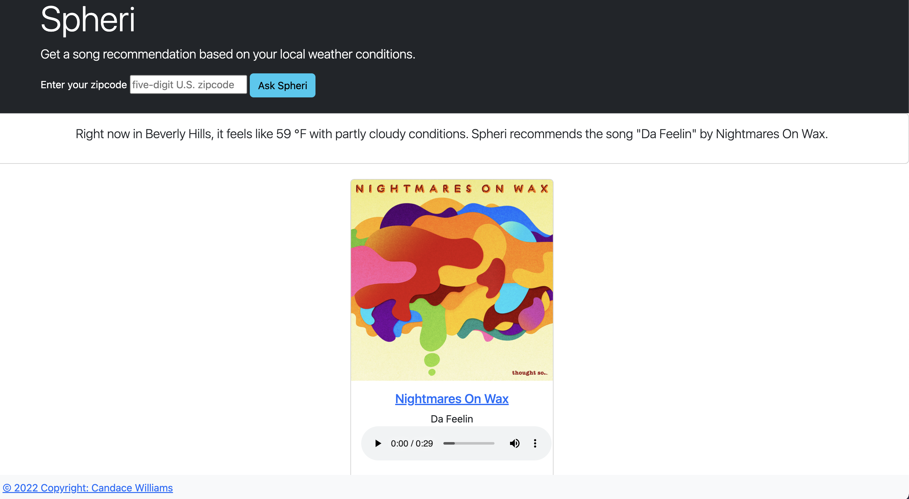

  [](https://www.gnu.org/licenses/gpl-3.0) 

# spheri.app

## Table of Contents

- [Description](#description)
- [Motivation](#motivation)
- [Learning](#learning)
- [Installation](#installation)
- [Tests](#tests)
- [Usage](#usage)
- [Credits](#credits)
- [License](#license)


## Description

Spheri is a web app that uses local weather information to generate song recommendations. Someone experiencing thundersnow can expect a different recommendation than someone experiencing clear conditions at 72℉.

Link to the deployed web app: https://spheri.app/ 

Alternative link: https://spheri.uk.r.appspot.com/

Link to r/Python post (500+ upvotes, 80 comments!): https://www.reddit.com/r/Python/comments/zb6ro9/i_got_laid_off_in_midoctober_and_decided_to_teach/

### Motivation

I was the ten-year-old who begged to stay up past 11 pm so I could watch meteorologist Steve Pool talk about El Niño, dew points, and the jet stream. Even though I did not take up meterology as an adult, the weather has a big impact on my mood. I wanted to create something that would help me find new music that matches whatever weather vibes I'm experiencing.

This app solves a problem my wife and I have. There is so much music on Spotify, that it's hard to choose which new songs to listen to. I find myself listening to the same playlists over and over again.

### Learning

I also built this project so I could cement my Python, Flask, git/GitHub, Bootstrap, APIs, unit testing, and Google Cloud deployment skills.

## Repo Overview
'''shell
├── LICENSE.txt
├── README.md
├── app
│   ├── constants.py
│   ├── main.py
│   ├── requirements.txt
│   └── templates
│       ├── empty.html
│       ├── error.html
│       ├── form.html
│       └── layout.html
├── assets
│   └── images
│       └── recommendation.png
├── env.sample
├── requirements.txt
├── tests
│   └── test_main.py
```

## Installation

If you want to see how the app looks to users, you can visit [http://spheri.app]

To run in a local environment:

1. Fork the code
2. Create and activate a Python virtual environment (if you need to install Python 3.x, visit [https://www.python.org/downloads/]):

```shell
$ python -m venv venv
$ source venv/bin/activate
```

3. Update `pip` and install the required dependencies:

```shell
(venv) $ pip install -U pip
(venv) $ pip install -r requirements.txt
```

4. Create a '''config.py''' file with the proper keys

- Create a new app at [https://developer.spotify.com/dashboard/applications].
- Create a '.env' file
- Fill in the client id and client secret:
```python
CLIENT_ID=''
CLIENT_SECRET=''
```
- Sign up for a free WeatherStack API account [https://weatherstack.com/product]
- Add your WeatherStack access key to the .env file:
```python
ACCESS_KEY=''
CLIENT_ID=''
CLIENT_SECRET=''
```

5. Start the Flask server:

```shell
(venv) $ python main.py
 * Serving Flask app "main" (lazy loading)
 * Environment: production
   WARNING: This is a development server. Do not use it in a production deployment.
   Use a production WSGI server instead.
 * Debug mode: on
 * Running on http://127.0.0.1:8080/ (Press CTRL+C to quit)
 * Restarting with stat
 * Debugger is active!
 * Debugger PIN: 339-986-221
 ```

 6. Open a browser to the specified local address and port (Usually http://127.0.0.1:8080/). Voila! 

## Tests

Tests are located in ```tests/test_main.py```. After you create your virtual environment and install the required packages, you can run ```test_main.py```. 

## Usage

A user can enter a valid U.S. zipcode, submit the zipcode, and receive a readout of local weather conditions as well as a song recommendation (via Spotify's recommendation API). A 30-second preview of the song can be accessed via the player. If a user clicks on the album art or the artist link, the corresponding Spotify track page will open.




## Credits

Useful links:
- Cory Schafer's Flask tutorial [https://www.youtube.com/watch?v=MwZwr5Tvyxo&list=PL-osiE80TeTs4UjLw5MM6OjgkjFeUxCYH]
- Bukola's Automate Spotify with Python [https://www.youtube.com/watch?v=7J_qcttfnJA]
- Freecodecamp's APIs for Beginners [https://www.youtube.com/watch?v=GZvSYJDk-us]
- Automate the Boring Stuff with Python [https://automatetheboringstuff.com/#toc]
- Marwonn's Spotify Playlist Analyzer [https://github.com/marwonn/spotify-playlist-generator-analyzer]
- Many thanks to my Code Mentor Greg [https://www.codementor.io/@ggorlen]. I had a thorny design issue because I didn't know I was going to use Flask when I started the project. Greg gave me strategies for how to refactor my existing code to include Flask. I was able to do the rest of the project without issues after a few pointers.
- Thanks to @BurningSquid for contributing thoughtful issues!   

## License

GNU General Public License v3.0 [https://choosealicense.com/licenses/gpl-3.0/]